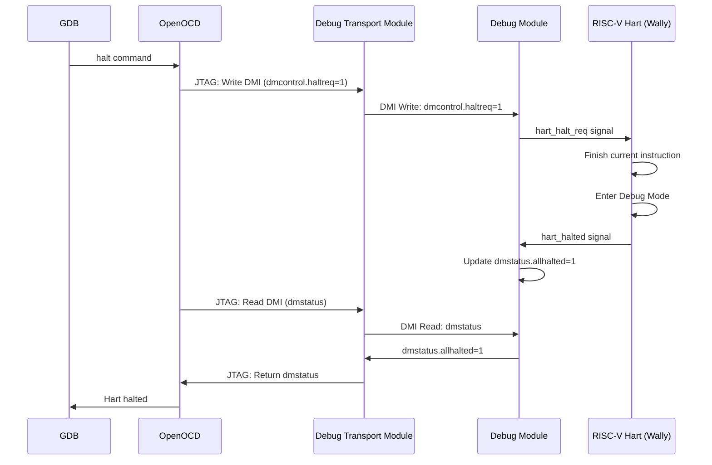
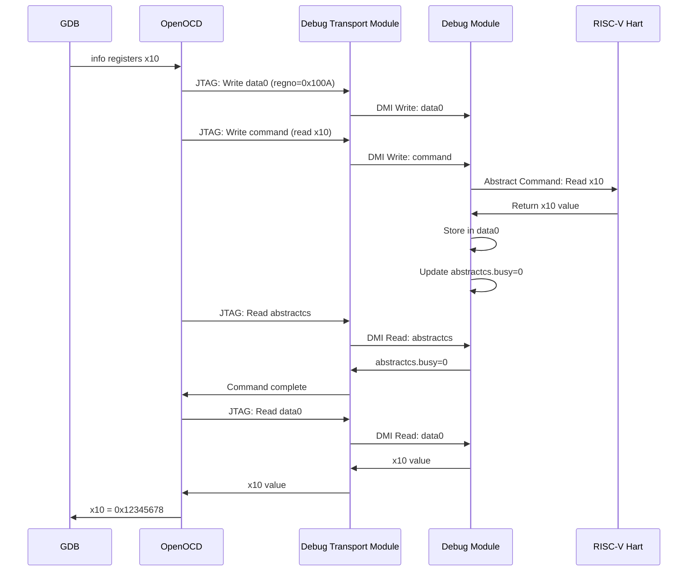
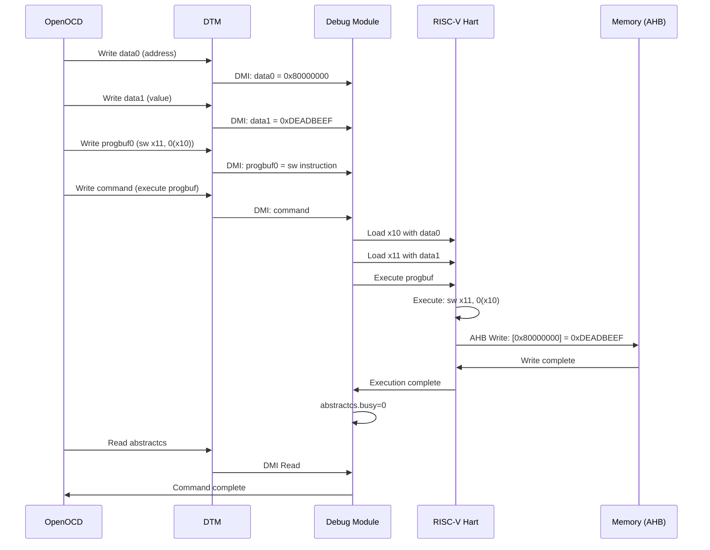
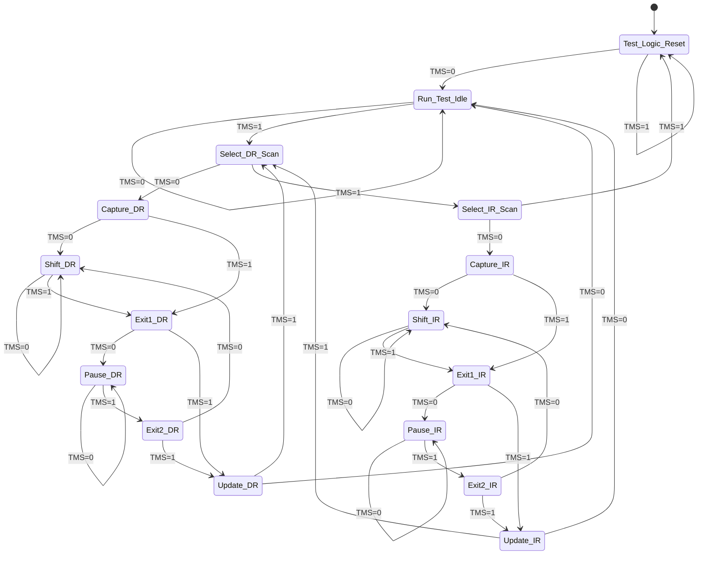
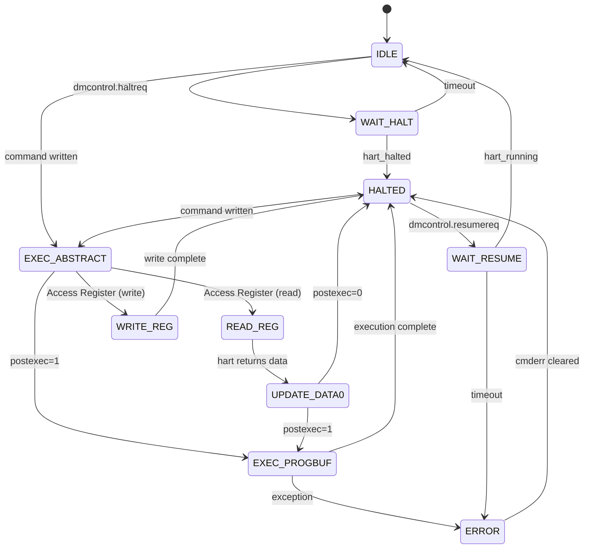

# Диаграммы системы отладки RISC-V

## 1. Последовательность операций отладки

### 1.1 Процесс остановки процессора (Halt)



### 1.2 Процесс чтения регистра



### 1.3 Процесс записи в память через Program Buffer



## 2. Структура регистров Debug Module

### 2.1 Карта адресов DM регистров

```
┌──────────┬─────────────────┬──────────────────────────────────────┐
│  Адрес   │  Имя регистра   │           Описание                   │
├──────────┼─────────────────┼──────────────────────────────────────┤
│  0x04    │  data0          │  Данные для абстрактных команд       │
│  0x05    │  data1          │  Дополнительные данные               │
│  ...     │  ...            │  ...                                 │
│  0x0F    │  data11         │  Последний регистр данных            │
├──────────┼─────────────────┼──────────────────────────────────────┤
│  0x10    │  dmcontrol      │  Управление Debug Module             │
│  0x11    │  dmstatus       │  Статус Debug Module                 │
│  0x12    │  hartinfo       │  Информация о hart                   │
│  0x13    │  haltsum1       │  Сводка остановленных hart           │
├──────────┼─────────────────┼──────────────────────────────────────┤
│  0x16    │  abstractcs     │  Статус абстрактных команд           │
│  0x17    │  command        │  Регистр команд                      │
│  0x18    │  abstractauto   │  Автоматическое выполнение           │
├──────────┼─────────────────┼──────────────────────────────────────┤
│  0x20    │  progbuf0       │  Program Buffer слово 0              │
│  0x21    │  progbuf1       │  Program Buffer слово 1              │
│  ...     │  ...            │  ...                                 │
│  0x2F    │  progbuf15      │  Program Buffer слово 15             │
├──────────┼─────────────────┼──────────────────────────────────────┤
│  0x38    │  sbcs           │  System Bus Access Control/Status    │
│  0x39    │  sbaddress0     │  System Bus Address (младшие биты)   │
│  0x3A    │  sbaddress1     │  System Bus Address (старшие биты)   │
│  0x3C    │  sbdata0        │  System Bus Data 0                   │
│  0x3D    │  sbdata1        │  System Bus Data 1                   │
└──────────┴─────────────────┴──────────────────────────────────────┘
```

### 2.2 Структура регистра dmcontrol (0x10)

```
Биты 31                                                           0
     ┌──┬──┬──┬──┬──┬──┬──┬──┬──┬──┬──┬──┬──┬──┬──┬──┬──┬──┬──┬──┐
     │haltreq│resumereq│hartreset│ackhavereset│  hasel  │hartsello│
     │  [31] │  [30]   │  [29]   │    [28]     │  [26]   │ [25:16] │
     └───────┴─────────┴─────────┴─────────────┴─────────┴─────────┘
     ┌──────────────────────────────────────────────────────────────┐
     │              hartselhi [15:6]              │  ndmreset  [1]  │
     │                                            │  dmactive  [0]  │
     └────────────────────────────────────────────────────────────────┘

Ключевые поля:
• haltreq [31]      - Запрос на остановку выбранного hart
• resumereq [30]    - Запрос на возобновление выбранного hart
• hartreset [29]    - Сброс выбранного hart
• hasel [26]        - Выбор нескольких hart одновременно
• hartsello [25:16] - Младшие биты селектора hart
• hartselhi [15:6]  - Старшие биты селектора hart
• ndmreset [1]      - Сброс всей системы (кроме DM)
• dmactive [0]      - Активация Debug Module
```

### 2.3 Структура регистра dmstatus (0x11)

```
Биты 31                                                           0
     ┌──────────────────────────────────────────────────────────────┐
     │impebreak│ allhavereset │ anyhavereset │ allresumeack │ anyresumeack │
     │  [22]   │    [19]      │    [18]      │    [17]      │    [16]      │
     └──────────────────────────────────────────────────────────────┘
     ┌──────────────────────────────────────────────────────────────┐
     │allnonexistent│anynonexistent│allunavail│anyunavail│allrunning│
     │    [15]      │    [14]      │  [13]    │  [12]    │  [11]    │
     └──────────────────────────────────────────────────────────────┘
     ┌──────────────────────────────────────────────────────────────┐
     │anyrunning│allhalted│anyhalted│authenticated│authbusy│hasresethaltreq│
     │  [10]    │  [9]    │  [8]    │    [7]      │  [6]   │     [5]       │
     └──────────────────────────────────────────────────────────────┘
     ┌──────────────────────────────────────────────────────────────┐
     │confstrptrvalid│  version [3:0]  │
     │     [4]       │  0=none, 2=v0.13│
     └──────────────────────────────────┘

Ключевые поля:
• allhalted [9]     - Все выбранные hart остановлены
• anyhalted [8]     - Хотя бы один выбранный hart остановлен
• allrunning [11]   - Все выбранные hart выполняются
• anyrunning [10]   - Хотя бы один выбранный hart выполняется
• version [3:0]     - Версия спецификации (2 = v0.13)
```

### 2.4 Структура регистра abstractcs (0x16)

```
Биты 31                                                           0
     ┌──────────────────────────────────────────────────────────────┐
     │  progbufsize [28:24]  │      reserved      │  busy [12]  │
     │  (размер progbuf)     │                    │  (команда   │
     │                       │                    │  выполняется)│
     └──────────────────────────────────────────────────────────────┘
     ┌──────────────────────────────────────────────────────────────┐
     │  cmderr [10:8]        │  datacount [3:0]   │
     │  (код ошибки)         │  (кол-во data reg) │
     └──────────────────────────────────────────────────────────────┘

Ключевые поля:
• progbufsize [28:24] - Размер Program Buffer (0-16 слов)
• busy [12]           - Абстрактная команда выполняется
• cmderr [10:8]       - Код ошибки последней команды:
                        0 = нет ошибки
                        1 = команда выполняется
                        2 = не поддерживается
                        3 = исключение
                        4 = halt/resume
                        7 = другая ошибка
• datacount [3:0]     - Количество data регистров (1-12)
```

### 2.5 Структура регистра command (0x17)

```
Биты 31                                                           0
     ┌──────────────────────────────────────────────────────────────┐
     │  cmdtype [31:24]      │       command-specific [23:0]        │
     │  0 = Access Register  │                                      │
     │  1 = Quick Access     │                                      │
     │  2 = Access Memory    │                                      │
     └──────────────────────────────────────────────────────────────┘

Для Access Register Command (cmdtype=0):
     ┌──────────────────────────────────────────────────────────────┐
     │aasize│aarpostincrement│ postexec│ transfer│ write│  regno   │
     │[22:20]│      [19]      │  [18]   │  [17]   │ [16] │ [15:0]   │
     └──────────────────────────────────────────────────────────────┘

Поля Access Register:
• aasize [22:20]        - Размер доступа (2=32bit, 3=64bit, 4=128bit)
• aarpostincrement [19] - Автоинкремент regno после операции
• postexec [18]         - Выполнить progbuf после команды
• transfer [17]         - Выполнить передачу данных
• write [16]            - 1=запись, 0=чтение
• regno [15:0]          - Номер регистра:
                          0x0000-0x0FFF: CSRs
                          0x1000-0x101F: GPRs (x0-x31)
                          0x1020-0x103F: FPRs (f0-f31)
```

## 3. Конечный автомат JTAG TAP



## 4. Конечный автомат Debug Module



## 5. Временная диаграмма DMI транзакции

```
Сигналы DMI для операции записи:

clk_i           ┌─┐ ┌─┐ ┌─┐ ┌─┐ ┌─┐ ┌─┐ ┌─┐ ┌─┐
                ┘ └─┘ └─┘ └─┘ └─┘ └─┘ └─┘ └─┘ └─

dmi_req_valid   ────┐           ┌───────────────
                    └───────────┘

dmi_req_ready   ────────┐   ┌───────────────────
                        └───┘

dmi_req_addr    ────<0x10>─────────────────────
                    (dmcontrol)

dmi_req_op      ────<WRITE>────────────────────
                      (2)

dmi_req_data    ────<0x80000001>───────────────
                    (haltreq=1, dmactive=1)

dmi_resp_valid  ────────────────────┐   ┌───────
                                    └───┘

dmi_resp_ready  ────────────────┐           ┌───
                                └───────────┘

dmi_resp_data   ────────────────<0x00000000>───

dmi_resp_err    ────────────────<0 (OK)>───────

Фазы:
1. DTM выставляет запрос (req_valid=1)
2. DM принимает запрос (req_ready=1) в следующем такте
3. DM обрабатывает команду (2-3 такта)
4. DM выставляет ответ (resp_valid=1)
5. DTM принимает ответ (resp_ready=1)
```

## 6. Пример конфигурации OpenOCD

```tcl
# target/riscv_wally.cfg

adapter driver ftdi
adapter speed 1000

ftdi vid_pid 0x0403 0x6010
ftdi layout_init 0x0008 0x001b
ftdi layout_signal nTRST -data 0x0010
ftdi layout_signal nSRST -data 0x0020

transport select jtag

set _CHIPNAME riscv
set _TARGETNAME $_CHIPNAME.cpu

jtag newtap $_CHIPNAME cpu -irlen 5 -expected-id 0x10000001

target create $_TARGETNAME riscv -chain-position $_TARGETNAME

# Настройки для RISC-V Debug v0.13
riscv set_prefer_sba off
riscv set_command_timeout_sec 10
riscv set_mem_access progbuf abstract sysbus

# Настройки для работы с памятью
riscv set_enable_virtual off

init
halt
```

## 7. Пример использования с GDB

```bash
# Терминал 1: Запуск OpenOCD
$ openocd -f interface/ftdi/olimex-arm-usb-ocd-h.cfg \
          -f target/riscv_wally.cfg

Open On-Chip Debugger 0.12.0
Info : JTAG tap: riscv.cpu tap/device found: 0x10000001
Info : datacount=1 progbufsize=2
Info : Examined RISC-V core; found 1 harts
Info :  hart 0: XLEN=64, misa=0x800000000014112d
Info : starting gdb server for riscv.cpu on 3333
Info : Listening on port 3333 for gdb connections

# Терминал 2: Запуск GDB
$ riscv64-unknown-elf-gdb program.elf

(gdb) target remote localhost:3333
Remote debugging using localhost:3333

(gdb) load
Loading section .text, size 0x1234 lma 0x80000000
Loading section .data, size 0x100 lma 0x80001234
Start address 0x80000000, load size 4916
Transfer rate: 2 KB/sec, 1229 bytes/write.

(gdb) break main
Breakpoint 1 at 0x80000100: file main.c, line 10.

(gdb) continue
Continuing.

Breakpoint 1, main () at main.c:10
10          int x = 42;

(gdb) info registers
ra             0x80000080
sp             0x80010000
gp             0x80002000
tp             0x0
t0             0x0
...

(gdb) x/4x 0x80000000
0x80000000:     0x00000297      0x02028593      0xf1402573      0x00100073

(gdb) step
11          printf("Hello from Wally!\n");

(gdb) print x
$1 = 42

(gdb) set var x = 100

(gdb) print x
$2 = 100
```

---

**Примечание:** Все диаграммы соответствуют спецификации RISC-V External Debug Support версии 0.13.
